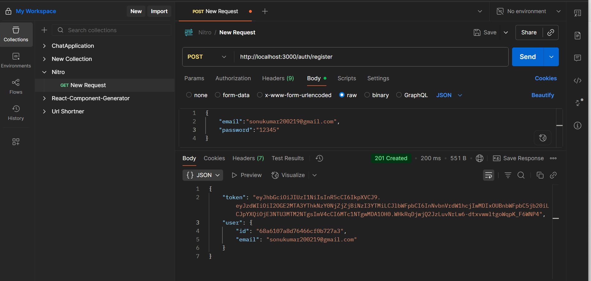
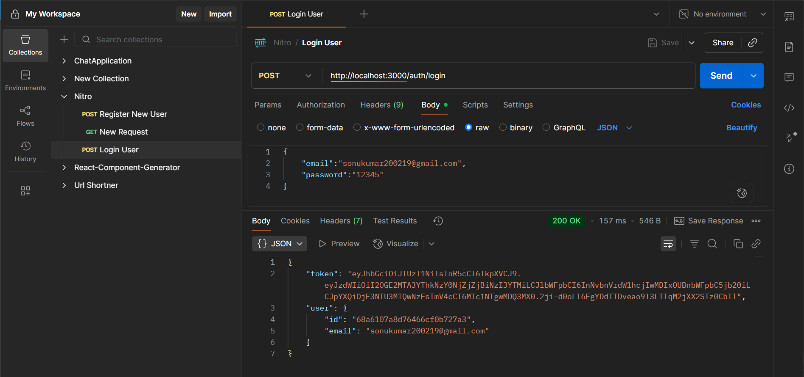
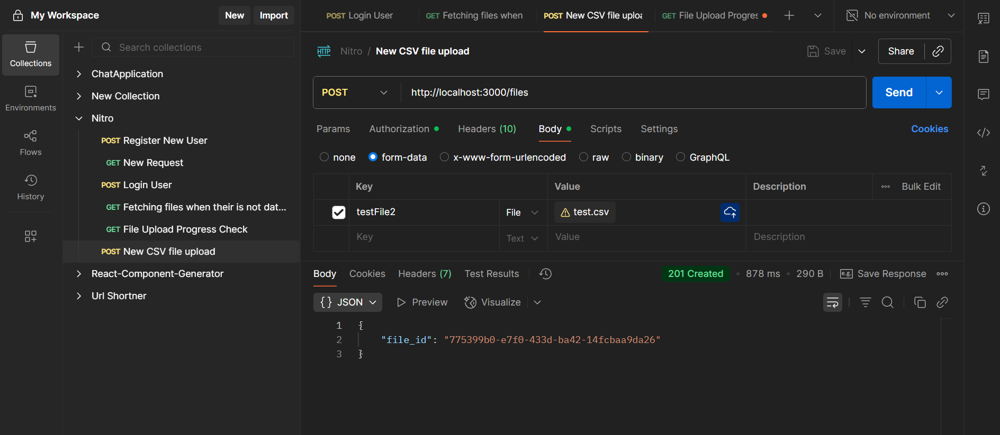
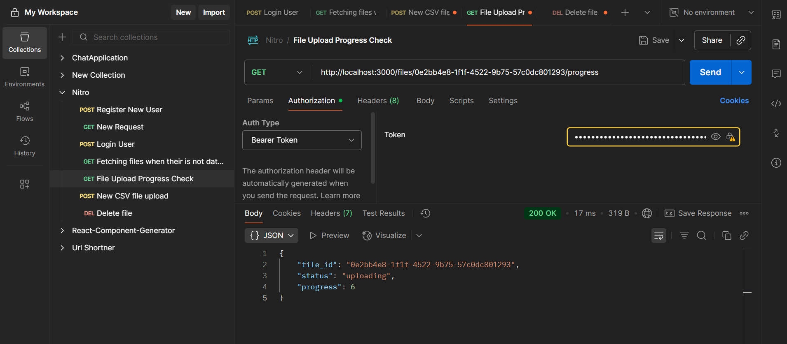
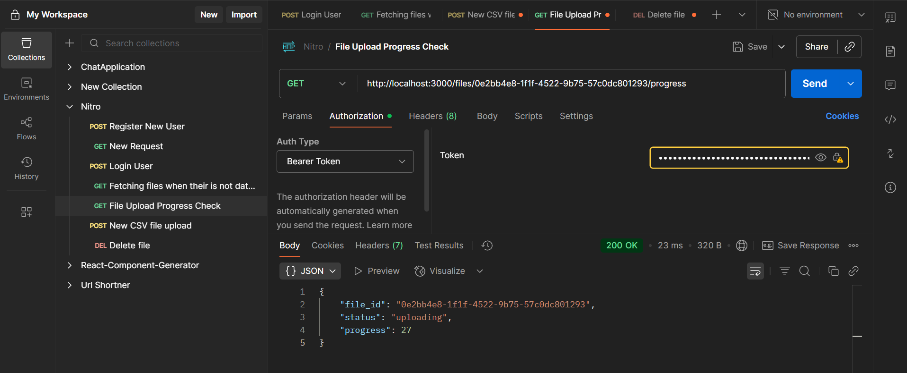
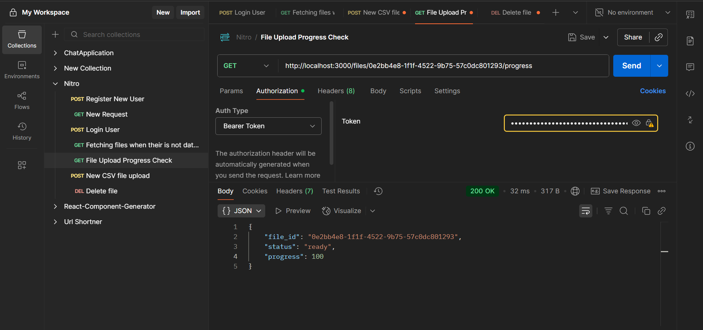
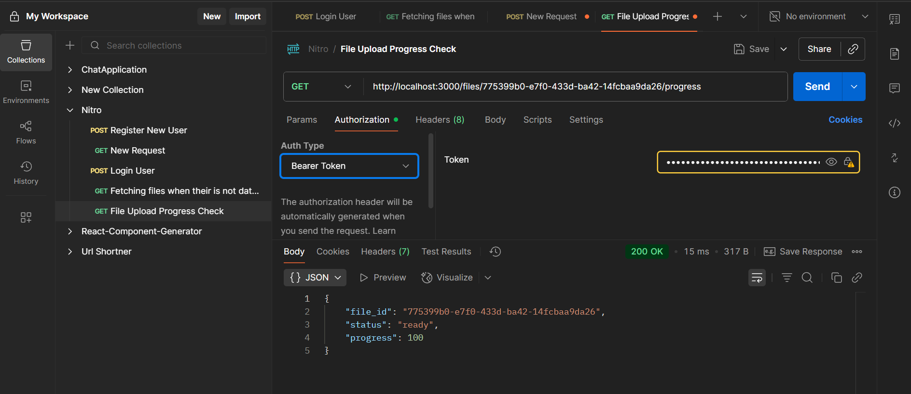
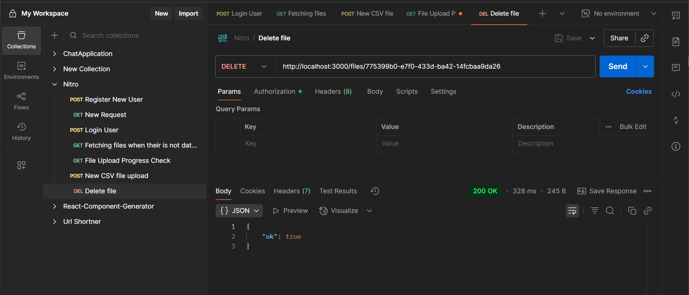

# File-Parser-CRUD-API-with-Progress-Tracking

## 1. Setup instructions

Step 1. ```npm init -y```

Step 2. ```npm install bcryptjs busboy csv-parse dotenv express jsonwebtoken mongodb mongoose morgan rimraf uuid```

Step 3. Create File Structure

        file-parser-api/
        │
        ├── config/
        │   └── db.js
        │
        ├── models/
        │   ├── File.js
        │   ├── RowChunk.js
        │   └── User.js
        │
        ├── routes/
        │   ├── authRoutes.js
        │   └── fileRoutes.js
        │
        ├── controllers/
        │   ├── authController.js
        │   └── fileController.js
        │
        ├── services/
        │   └── fileService.js
        │
        ├── utils/
        │   ├── parser.js
        │   ├── progress.js
        │   └── hash.js
        │
        ├── middlewares/
        │   ├── auth.js
        │   └── errorHandler.js
        │
        └── uploads/
        │
        │── .env
        │── package.json
        ├── server.js

Step 4. Make Changes in package.json

        - Change ```"main":"index.js" to "main": "server.js"```
        - Added ```"type": "module"```
        - Add npm scripts to package.json

                "scripts":
                {
                    "start": "node src/server.mjs",
                    "dev": "nodemon src/server.mjs"
                }

Step 5. Setup Environment Variables

        PORT=3000
        MONGO_URI=mongodb://127.0.0.1:27017/file_parser_demo
        JWT_SECRET=sonu_kr_19
        ENABLE_AUTH=true
        JWT_EXPIRES_IN=1d
        ALLOW_REGISTRATION=true
    
Step 6. Run Command ```npm run dev``` Or ```npm start```


## 2. API documentation

**1. Authentication**

- 1.1 User Registration

  - **POST** /api/auth/register
  - **Request Body**

        {
                "email": "sonukumar200219@gmail.com",
                "password": "12345"
        }
  - **Response Body**
  
        {
        "token": "eyJhbGciOiJIUzI1NiIsInR5cCI6IkpXVCJ9eyJzdWIiOiI2OGE2YzMzNmY0YWNmYWJiNzJjZGJhZmQiLCJlbWFpbCI6InNvbnVAZXhhbXBsZS5jb20iLCJpYXQiOjE3NTU3NTk0MTQsImV4cCI6MTc1NTg0NTgxNH0.Cuw9LyQY4oJPkBOiNTE5-VtP1jdef3V7k0U5l5wqVuw",
        "user": {
                "id": "68a6c336f4acfabb72cdbafd",
                "email": "sonukumar200219@gmail.com"
        }
        }
   - **Screenshot:**
   

- 1.2 User Login

  - **POST** /api/auth/login
  - **Request Body**

        {
                "email":"sonukumar200219@gmail.com",
                "password":"12345"
        }

  - **Response Body**

        {
        "token": "eyJhbGciOiJIUzI1NiIsInR5cCI6IkpXVCJ9eyJzdWIiOiI2OGE2YzMzNmY0YWNmYWJiNzJjZGJhZmQiLCJlbWFpbCI6InNvbnVAZXhhbXBsZS5jb20iLCJpYXQiOjE3NTU3NTk0MTQsImV4cCI6MTc1NTg0NTgxNH0.Cuw9LyQY4oJPkBOiNTE5-VtP1jdef3V7k0U5l5wqVuw",
        "user": {
                "id": "68a6c336f4acfabb72cdbafd",
                "email": "sonukumar200219@gmail.com"
        }
        }
   - **Screenshot:**
   


**2. File Upload and Processing**

- 2.1 Upload file
  - **POST** api/files
  - **Headers:**

        Authorization: Bearer <token>
        Content-Type: multipart/form-data

  - **Form Data:**

        Upload type is file: upload a CSV file of large size to see progress (~200MB)

  - **Response:**

        {
                "file_id": "a45c991c-49bf-4789-bfb1-abf5942aaccf"
        }

  - **Screenshot:**
  

- 2.2 Get File Progress
   - **GET** /api/files/:id/progress

        ```
        while uploading
        {
                "file_id": "6362f67a-7f94-4250-bf5c-c06eb4fc374f",
                "status": "uploading",
                "progress": 76
        }
        ----------------------------------------------------------
        when uploading is completed
        {
                "file_id": "6362f67a-7f94-4250-bf5c-c06eb4fc374f",
                "status": "ready",
                "progress": 100
        }

   - **Screenshots**
   
   
   

- 2.3 **Stream File Progress**
   - **GET** /api/files/:id/stream
   - Stream progress updates in real-time using Server-Sent Events (SSE).


- 2.5 **Get File Content**
   - **GET** /api/files/:id
   - When file uploading is in progress
        
        {
                "message": "File upload or processing in progress. Please try again later."
        }
   - **Screenshot:**
   

   - When file is already uploaded then we get data in console
        
        ```
        1: 00007FF6244E097D node::SetCppgcReference+17261
        2: 00007FF624448E08 v8::base::CPU::num_virtual_address_bits+92312
        3: 00007FF624FC8B21 v8::Isolate::ReportExternalAllocationLimitReached+65
        4: 00007FF624FB5A06 v8::Function::Experimental_IsNopFunction+2790
        5: 00007FF624E05110 v8::internal::StrongRootAllocatorBase::StrongRootAllocatorBase+31392
        6: 00007FF624E021AA v8::internal::StrongRootAllocatorBase::StrongRootAllocatorBase+19258
        7: 00007FF624E17A41 v8::Isolate::GetHeapProfiler+7825
        8: 00007FF624E182BA v8::Isolate::GetHeapProfiler+9994
        9: 00007FF624E28D57 v8::Isolate::GetHeapProfiler+78247
        10: 00007FF624AF1C7B v8::internal::Version::GetString+434555
        ...
        ```

- 2.6 **List All Files**
   - **GET** /api/files/
   - **Response:**
        
        ```
        [
        {
                "_id": "8c64854c-832b-472a-83f1-e014701e8aa9",
                "status": "processing",
                "uploadProgress": 100,
                "processProgress": 20,
                "created_at": "2025-08-21T07:32:29.954Z",
                "updated_at": "2025-08-21T07:33:20.161Z",
                "__v": 0,
                "size": 209088000,
                "filename": "test.csv",
                "mimetype": "text/csv",
                "storedPath": "D:\\project\\Nitro\\File-Parser-CRUD-API-with-Progress-Tracking\\uploads\\8c64854c-832b-472a-83f1-e014701e8aa9__test.csv"
        },
        {
                "_id": "a45c991c-49bf-4789-bfb1-abf5942aaccf",
                "status": "ready",
                "uploadProgress": 100,
                "processProgress": 100,
                "created_at": "2025-08-21T07:13:58.178Z",
                "updated_at": "2025-08-21T07:16:32.295Z",
                "__v": 0,
                "size": 209088000,
                "filename": "test.csv",
                "mimetype": "text/csv",
                "storedPath": "D:\\project\\Nitro\\File-Parser-CRUD-API-with-Progress-Tracking\\uploads\\a45c991c-49bf-4789-bfb1-abf5942aaccf__test.csv"
        },
        {
                "_id": "6362f67a-7f94-4250-bf5c-c06eb4fc374f",
                "status": "ready",
                "uploadProgress": 100,
                "processProgress": 100,
                "created_at": "2025-08-20T20:42:16.409Z",
                "updated_at": "2025-08-20T20:44:12.772Z",
                "__v": 0,
                "size": 209088000,
                "filename": "test.csv",
                "mimetype": "text/csv",
                "storedPath": "D:\\project\\Nitro\\File-Parser-CRUD-API-with-Progress-Tracking\\uploads\\6362f67a-7f94-4250-bf5c-c06eb4fc374f__test.csv"
        },
        {
                "_id": "d101f5f8-8b06-4f30-8493-2360ab1b17df",
                "status": "ready",
                "uploadProgress": 100,
                "processProgress": 100,
                "created_at": "2025-08-20T18:40:07.017Z",
                "updated_at": "2025-08-20T18:40:07.058Z",
                "__v": 0,
                "size": 1210,
                "filename": "test.csv",
                "mimetype": "text/csv",
                "storedPath": "D:\\project\\Nitro\\File-Parser-CRUD-API-with-Progress-Tracking\\src\\uploads\\d101f5f8-8b06-4f30-8493-2360ab1b17df__test.csv"
        },
        {
                "_id": "04dbb184-ab79-40b5-a8c5-a1a11078d514",
                "status": "ready",
                "uploadProgress": 100,
                "processProgress": 100,
                "created_at": "2025-08-20T18:39:10.286Z",
                "updated_at": "2025-08-20T18:39:10.482Z",
                "__v": 0,
                "size": 1210,
                "filename": "test.csv",
                "mimetype": "text/csv",
                "storedPath": "D:\\project\\Nitro\\File-Parser-CRUD-API-with-Progress-Tracking\\src\\uploads\\04dbb184-ab79-40b5-a8c5-a1a11078d514__test.csv"
        }
        ]
        ```
   
   

- 2.7 **Delete File**
   - **DELETE** /api/files/:id
   - **Header**
        ```
        Authorization: Bearer <token>
        ```
   - **Screenshots:**
   

---------------------------------------------------------------------------------------------------
